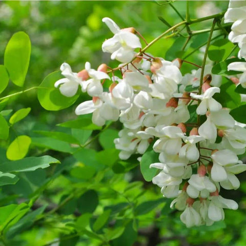
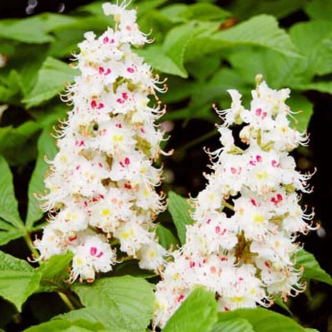
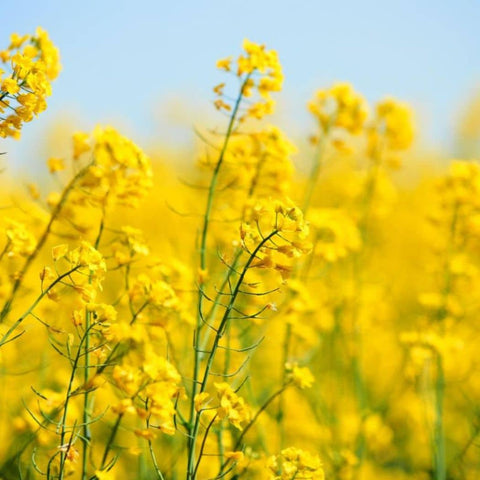
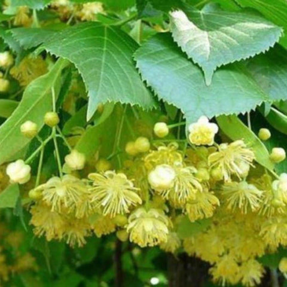
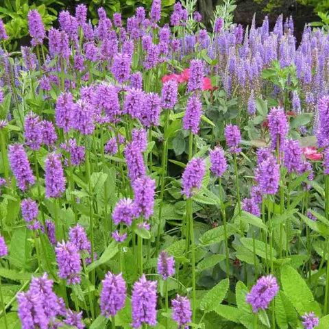
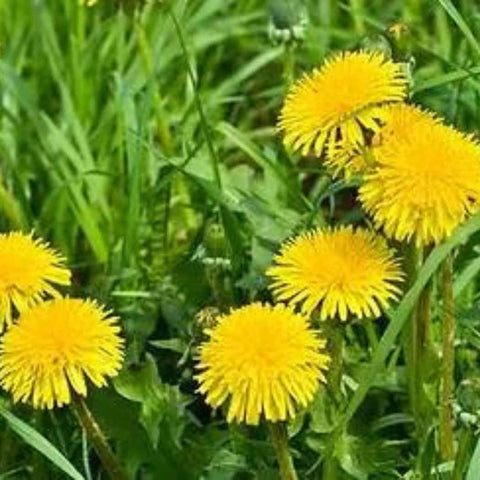

# Honey

## Literature on different kinds of honey in mead
### Good
- **Alfalfa (erba medica, _Medicago sativa_)** 
    - high dextrose, low ash, low nitrogen.

- **Blackberry**:
    - High pH (5.0), high Maltose (11.3%), high ash, high nitrogen.

- **Blueberry**
    - like a light version of orange blossom
    - High Maltose, low acid, higher pH, high nitrogen.

- **Buckwheat**
    - watch the type though. Taste it first before buying a lot as some strains are musty and odd.

- **Carrot blossom**
    - neat and earthy.

- **Cherry or apple blossom**
    - like drinking in the aroma of spring.
       
* **Chestnut**
    * *love it or hate it*
    * Gives the mead a really deep beautiful color and some much appreciated tannins
    * The chestnut honey gives a lot of bochet-like flavours without any kind of heavily caramelized sugar.
    * Intense dry flavour with strong accents of malt
    * It is smooth and sweet (but dry according to my hydrometer), a fantastic mouthfeel, the oak gave some vanilla flavours I really dig.
    * There is a bit of acidity as you would expect from a dry mead but it is unidimensional.

- **Chicory**
    - mentholly an refreshing in a good way. Perfect palate cleanser between courses.

- **Christmas Berry Honey**
    - Flavor profile and characteristics
        - Harvested from Hawaiian Christmas Berry (Wilelaiki) blossoms, this honey is bright golden yellow and slower to crystallize. Christmas Berry Honey has a nice fruit flavor and an herbal, slightly spiced aftertaste. Some have described it as having a butterscotch-like flavor.
    - Tips for using Christmas Berry Honey for Mead Making:
        - This honey’s unique sweet & confectionary tasting notes makes it perfect for a batch of holiday mead or spiced mead! Consider adding mulling spices or caramelizing the honey before fermentation to make a “bochet” (carmelized honey mead).

* **Citrus**
    * By analysis of the numbers, citrus honey appears to be an excellent candidate for brewing. While the dextrose level is a bit high, moisture is low, pH is in the middle, and ash content is very low. The low nitrogen content might dictate higher than normal yeast nutrient use. Citrus honey of any blend is marketed as "Orange Blossom," and is light in flavor and very aromatic. Micah Millspaw has made some excellent mead from orange blossom honey.

- **Meadowfoam** 
    - can you say toasted marshmallow?

- **Orange blossom** 
    - perfect balance of flavour and acidity straight up. This is the one I recommend people start with.
    - Flavor profile and characteristics:
        - Orange blossom honey offers a distinct citrus aroma with sweet, floral undertones. Zesty, juicy and floral character shines through in the finished mead, especially when Orange Blossom Honey is used for backsweetening.
    - Tips for using Orange Blossom Honey for Mead Making:
        - Orange Blossom Honey is perfect for making refreshing, aromatic meads, especially when aiming for lighter, fruit-forward beverages.
        - This honey style is excellent for making melomels (fruited meads), because the citrusy character adds even more fruit character.

- **Poison oak or ivy**
    - buttery an awesome. No you won't react to it.

- **Pumpkin blossom -** 
    - all day every day. Oh so good and rich. Oh wait nvm this is horrible honey never buy this just let me know where you find it so I can umm destroy all the stock.

- **Snowberry**
    - neat residual acidity a great mead to age.

- **Tupelo** 
    - buttery rich and oh so pricey but worth every cent.
    - White tupelo is the primary source for the light unblended honey sold as tupelo honey. It has a very high levulose content, low dextrose and high maltose count, which make it attractive to brewers. Low ash, high Acids and moderate pH

- **Miele di acacia**
    - 
    - Il miele di acacia è un miele monofloreale ed è il miele più diffuso e apprezzato in Italia.
    - Il miele di acacia è un miele pallido, liquido, quasi simile al vetro. È ottenuto dalle api che si nutrono di fiori di acacia. Il miele di acacia tende a non cristallizzare perché ricco di fruttosio e ha un gusto molto gradevole in grado di soddisfare un po’ tutti i palati.

- **Miele di Millefiori**
    - Come si può facilmente intuire, si tratta di un miele multifloreale, prodotto da diverse tipologie floreali (principalmente acacia, tiglio e castagno).
    - In base al periodo dell’anno in cui viene prodotto possiamo individuare due macrocategorie:
    - Miele millefiori chiaro: si produce a partire da inizio primavera fino a giugno/luglio, ha un colore chiaro e trasparente e un sapore più delicato e dolce rispetto alle altre varianti, ma meno intenso. Dopo alcuni mesi dal raccolto il prodotto tende a cristallizzare.
    - Miele millefiori scuro: si produce sul finire dell’estate, ha una colorazione scura o ambrata. Il gusto è più deciso rispetto alla variante precedente con un retrogusto leggermente amarognolo. Ricorda molto il miele di castagno. La consistenza è cremosa e la sua cristallizzazione è più lenta.

- **Miele di castagno**
    - 
    - Il miele di castagno si produce a partire dal nettare della pianta omonima, molto diffusa in tutto il nostro Appennino. È tra i mieli con un colore scuro, marrone molto intenso.
    - Non fatevi ingannare dal colore scuro del miele: più un miele è scuro più la sua azione antiossidante è considerevole!
    - Il profumo del miele di castagno è più incisivo rispetto a quello degli altri mieli, leggermente acre e pungente. Anche il gusto rispecchia queste sue peculiarità: amarognolo e deciso. La dolcezza, quindi, non è proprio il suo tratto distintivo: per questo motivo può non essere indicato come dolcificante ma è ottimo invece per accompagnare i formaggi! Anche in questo caso, vista la maggior presenza di fruttosio rispetto al glucosio, difficilmente cristallizza.

- **Miele di colza**
    - 
    - La colza è una pianta i cui fiori sono di un di colore giallo molto intenso. È molto precoce perché fiorisce da aprile a giugno. I fiori sono particolarmente ricchi di nettare e polline e questo permette di ottenere una grande quantità di miele.
    - Il miele di colza è un miele molto dolce dal colore chiaro con sfumature che vanno dal giallo, al beige e al bianco. Proprio per la sua dolcezza è tra i tipi di miele preferito dai bambini!
    - È anche leggermente cremoso e tende a cristallizzarsi più velocemente di quasi tutti gli altri tipi di miele, diventando solido e duro. In questo caso, non vi preoccupate, è sufficiente mescolare energicamente il miele per ridargli una consistenza cremosa.

- **Miele di tiglio**
    - 
    - Il miele di tiglio è tra i più delicati in commercio e ha un colore dorato chiaro. Il suo sapore è dolce e con un aroma che rimanda ai fiori di tiglio. La sua dolcezza e la sua fluidità lo rendono molto adatto ad essere utilizzato come sostituto dello zucchero tradizionale in vari tipi di bevande.
    - Il suo profumo è meno intenso rispetto ad altri tipi di miele, ma il suo sapore e il suo aroma delicato lo rendono particolarmente sofisticato.

- **Miele di Stachys**
    - 
    - La Stachys è un'erba officinale che cresce sulle stoppie di grano (residuo degli steli) dopo la trebbiatura.
    - Il miele che si ottiene da quest’erba è estremamente elegante e molto raro, perché il processo per ottenerlo è complesso. Ha una consistenza molto cremosa, quasi burrosa a seguito della cristallizzazione che è quasi assente. Ha un colore bianco latte, gusto dolce ma non troppo, con note che rimandano alle mandorle e al fieno.
    - Una curiosità: è uno dei mieli che meglio si presta a caramellare le carni rosse in cucina! 

- **Miele di Tarassaco**
    - 
    - Il tarassaco è una pianta erbacea che cresce spontaneamente in zone pianeggianti e montuose. Il miele di tarassaco ha un colore giallo intenso e con un sentore pungente, intenso, persistente, che ricorda l’ammoniaca. Il sapore, tuttavia, è delicato e balsamico, con un retrogusto di camomilla.

- **Miele di Girasole**
    - Il miele di Girasole ha un bel colore giallo vivace. Al palato è aromatico ma anche fresco. Il suo aroma è delicato e ricorda quello della cera. Non è molto dolce e, come per il miele di castagno, si presta particolarmente in abbinamento con i formaggi.

- **Miele di Melata**
    - Come abbiamo già visto, il miele di melata è un miele che anziché essere prodotto col nettare dei fiori, viene ricavato dalla secrezione di altri insetti, ovvero una sostanza che si trova sulle foglie o sulla corteccia degli alberi, la melata appunto.
    - È uno dei mieli più rari e salutari in commercio. In confronto al tradizionale miele di nettare, quello di melata è meno dolce, il sapore ricorda quello del caramello, con retrogusto leggermente amarognolo. Il colore è molto scuro, quasi nero, mentre la consistenza è compatta come quella del miele di nettare, ma non tende a cristallizzarsi.

---
> To sort 
---

- Fireweed - awesome stuff. Very floral
    - [Epilobium angustifolium - Wikipedia](https://it.wikipedia.org/wiki/Epilobium_angustifolium)
    - Other than slightly lower than normal total acids and ash, fireweed honey looks like a very average honey. Fireweed honey did not express a dramatic nose or flavor, and doesn't seem to create much of a stir as a mead.

- Heather - another way too pricey but awesome one. Very floral and rich.

* Mango Blossom Honey
    * Flavor profile and characteristics:
        - Mango blossom honey features a tropical, fruity profile with a smooth, mellow sweetness.
        - Because it’s harvested from the nectar of blooming mango trees, this honey possesses tropical fruit and floral notes.
    - Tips for using Mango Blossom Honey for Mead Making:
        - This honey is excellent for crafting exotic, tropical-inspired meads, often enjoyed semi-sweet or sweet.
        - Try making a mango melomel (fruited mead), with diced mango chunks!

* Hawaiian Flower Honey
    * Flavor profile and characteristics:
        - Hawaiian wildflower honey, sourced from diverse flowers across Hawaii, offers a complex, exotic flavor profile. It often includes notes of tropical fruit, hibiscus, plumeria and even subtle earthiness, perfect for creating unique, aromatic meads.
    * Tips for using Hawaiian Wildflower Honey for Mead Making:
        - Take inspiration from the source and make a Hawaiian mead with hibiscus flowers, tropical fruit or even ginger.

- Japanese Bamboo: 
    - High Maltose, higher pH, low to medium ash, high nitrogen.

- Chinquapin: 
    - Low moisture, low dextrose, high maltose, very high other sugars, very high ash (.761%).

- Gallberry: 
    - Low acid, higher pH (4.2).

- Black Locust: 
    - High maltose, very low acid (15.54), very low ash (.052%), low nitrogen.

- Peppermint: 
    - High pH (4.7), high acid, very high ash (.473)

- Prune: 
    - High moisture, high maltose, pH 6.0!, acids very low (11.80), ash .694%

- Vetch, hairy: 
    - Average sugar values, low pH, low total acids, very low ash, low nitrogen.

* _Clover_: 
    * The values shown here are for sweet clover honey, and the U.S.D.A. has several dozen specimens profiled in their bulletin. Moisture levels tend to run on the high side, making clover honey a candidate for quick use. As with most of the lighter flavored honeys, ash content is low, as is total acid content, which would contribute to a softer flavor profile. It looks like a great case honey for flavored meads.

* _Mesquite_: 
    * High pH is due to lack of total acid, not high ash buffering. This honey should ferment well with a healthy dose of nitrogen and no pH adjustment. Low moisture and acid content make for higher sugar content by weight. Low ash should mean light color and minimal offensive odor or flavor. Might require some acid before bottling for balance, especially in sweeter meads.

* _Sage_: 
    * Another low ash, middle-of-the-road sugar blend honey. Known to be light in flavor with a delicate and inviting aroma. One to be explored.

* _Tulip Poplar_: 
    * Tulip Poplar honey is a very distinctive honey in aroma, and although one of the darker honeys, has a mild and appealing flavor. Tulip poplar honey has a high maltose content, lending to its complexity, and, like other dark honeys, is high in ash content. Tulip poplar honey is widely available from the north to the south throughout the midwest.

## Miele di Erba medica (Alfalfa)

  
  

")

Erba medica (Alfalfa)

Il miele di [Erba medica](https://www.lerboristeria.com/erbario/alfalfa.php) è prodotto dalle api che suggono il nettare dai fiori della pianta Medicago sativa (Alfalfa), una Leguminosa che possiede una completezza nutrizionale dovuta alle sue lunghissime radici, che penetrano nel suolo alla ricerca di acqua e dei minerali situati profondamente nel terreno.  
La produzione del miele che da essa si ricava dipende molto dalle condizioni ambientali di calore e umidità, che ne possono condizionare grandemente il raccolto, il quale può essere perciò più o meno abbondante a seconda dell'andamento della stagione, poiché i fattori climatici avversi ne influenzano negativamente la produzione.  
  
Il miele di Erba medica si presenta di colore ambrato chiaro quando è liquido, beige chiaro o nocciola quando cristallizza, dopo pochi mesi dal raccolto. E' un miele dal sapore dolce delicato, vellutato, con note vegetali ed erbacee di piante officinali; sprigiona sentori di erba tagliata.  
Gli sono attribuite proprietà [antispasmodiche](https://www.lerboristeria.com/glossario/antispasmodico.php), [diuretiche](https://www.lerboristeria.com/glossario/diuretico.php) e purificanti, tonificanti, energetiche, utili anche per gli sportivi. E' ricco di [antiossidanti](https://www.lerboristeria.com/glossario/antiossidante.php), [vitamine](https://www.lerboristeria.com/articoli/2006_03.php), [minerali](https://www.lerboristeria.com/articoli/2006_06.php), è lenitivo per la tosse, calmante, [espettorante](https://www.lerboristeria.com/glossario/espettorante.php) e fluidificante catarrale.  
  
Il miele in purezza di Erba medica si trova generalmente allo stato liquido solo poco tempo dopo il raccolto, solitamente in Settembre-Ottobre; è preferibile consumare quello biologico italiano, che garantisce una elevata qualità. Trovare nei mesi successivi un miele di Erba medica ancora allo stato liquido può significare che non sia monoflorale, o che sia stato sottoposto a trattamenti termici, assolutamente sconsigliati.  
Il suo uso è piuttosto versatile: come dolcificante per caffè, [tè](https://www.lerboristeria.com/erbario/theverde.php) e tisane, dei quali non altera il sapore; con lo yogurt, in abbinamento a formaggi stagionati, o freschi di capra. Ottimo per la preparazione del torrone.  
  

## Miele di Lavanda

  
  

Lavanda

Il miele di [Lavanda](https://www.lerboristeria.com/erbario/lavanda.php) è prodotto da diverse varietà di piante appartenenti al genere Lavandula, in particolare [Lavandula angustifolia](https://www.lerboristeria.com/articoli/2021_09_lavanda.php) o Lavanda vera, oltre a Lavandula latifolia o Lavandula spica (spigo), e Lavandino (un ibrido fra i due). La sua reperibilità è piuttosto rara perché la produzione necessita di grandi distese di piantagioni di questa pianta, come avviene soprattutto nella Provenza, in Francia.  
  
In Italia il raro ed esclusivo miele monoflora di Lavanda è prodotto solamente in Sardegna, dalle api che visitano i particolari fiori della [Lavanda selvatica](https://www.lerboristeria.com/articoli/2005_12.php), o Lavandula stoechas, che cresce spontanea nelle radure assolate, nei pascoli cespugliati spesso associato ai Cisti, su terreni acidi dal livello del mare fino a 1000 metri di altitudine.  
  
Il miele monoflorale di Lavandula angustifolia e Lavandula latifolia, quando si trova ancora allo stato liquido, ha colore giallo paglierino chiaro tendente al dorato, ma, poiché cristallizza piuttosto rapidamente, il colore vira verso il beige chiaro fino al bianco. Il gusto e la fragranza sono peculiari, intensi, con un deciso aroma floreale e fruttato.  
  
Le caratteristiche organolettiche del miele monoflora di Lavandula stoechas, particolarmente pregiato, differiscono decisamente per il gusto particolarmente delicato, finemente aromatico, la leggera fragranza con lievi sentori floreali, e per il colore ambra-dorato.  
Il miele ricavato dal Lavandino (l'ibrido sterile fra Lavandula angustifolia e L. latifolia) ha fragranza e gusto molto leggeri e meno intensi, talmente tenui che talora non si percepisce il sentore di miele di Lavanda. Inoltre, poiché è un ibrido sterile, non produce [polline](https://www.lerboristeria.com/articoli/2000_12.php), che invece è utile nelle altre due varietà a caratterizzarne la provenienza e la purezza.  
  
Il miele di Lavanda ha in generale proprietà che richiamano le piante da cui è ricavato, quindi risulta rilassante e calmante del sistema nervoso centrale, rasserenante e [spasmolitico](https://www.lerboristeria.com/glossario/spasmolitico.php) per le tensioni sia fisiche che psichiche, contro l'[ansia](https://www.lerboristeria.com/articoli/2017_02_ansia_stress_insonnia_depressione.php) e l'[insonnia](https://www.lerboristeria.com/articoli/2009_11_fitoterapia_insonnia.php). Inoltre è balsamico e [antisettico](https://www.lerboristeria.com/glossario/antisettico.php) per le vie respiratorie, contro la tosse e la raucedine; antisettico delle vie uro-genitali; digestivo, [antispasmodico](https://www.lerboristeria.com/glossario/antispasmodico.php) e [colagogo](https://www.lerboristeria.com/glossario/colagogo.php)- [coleretico](https://www.lerboristeria.com/glossario/coleretico.php). E' un miele che, oltre agli zuccheri semplici come glucosio e fruttosio, è ricco di [minerali](https://www.lerboristeria.com/articoli/2006_06.php) fra cui [ferro](https://www.lerboristeria.com/articoli/2006_09.php), consigliato per bambini, anziani, sportivi, persone [anemiche](https://www.lerboristeria.com/glossario/anemia.php).  
  
E' adatto come dolcificante per colazione, per spuntini energetici prima dell'attività sportiva, dello studio o del lavoro particolarmente impegnativi.  
In cucina si abbina particolarmente bene con il Pecorino sardo stagionato, o altri formaggi dal sapore deciso, e con la frutta.  
Anticamente si applicava sulle ferite come [cicatrizzante](https://www.lerboristeria.com/glossario/cicatrizzante.php); può essere utile per lenire punture di insetti. Come tutti i mieli, non va sottoposto al calore, che ne altererebbe le qualità organolettiche e le proprietà officinali.  
  

## Miele di Rosmarino

  
  

Rosmarino

Il miele di [Rosmarino](https://www.lerboristeria.com/erbario/rosmarino.php) è prodotto dalle api che bottinano sui i fiori del Rosmarinus officinalis, una pianta tipica della macchia mediterranea, diffusa in tutte le zone costiere italiane, che viene anche coltivato come pianta officinale e aromatica da condimento. In Italia le produzioni più significative di miele di Rosmarino si trovano in Sardegna e in Puglia.  
  
Il miele di Rosmarino allo stato liquido ha un colore giallo paglierino chiaro che vira al bianco avorio quando cristallizza con una pastosità fine, non molti mesi dopo il raccolto, diventando molto denso, quasi solido.  
Ha un sapore molto dolce, con retrogusto acidulo e aroma di [mandorle](https://www.lerboristeria.com/erbario/mandorlo.php) e agrumi, sentori di [erbe aromatiche](https://www.lerboristeria.com/articoli/2013_04_spezie.php) officinali e floreali, che ricordano il profumo dei suoi fiori.  
  
Difficile da reperire in purezza, a parte in Sardegna dove il Rosmarino fiorisce per quasi tutto l'anno per le condizioni climatiche favorevoli, in cucina lo si abbina con formaggi sapidi, come il Pecorino sardo stagionato e il pecorino semi-stagionato come il "Fiore Sardo", o con formaggi erborinati. Ottimo su fette di pane per una merenda energetica e salutare, e con il [tè](https://www.lerboristeria.com/erbario/theverde.php).  
  
Analogamente alla pianta di provenienza, gli si possono attribuire discrete proprietà salutari per il fegato, del quale favorisce la [depurazione](https://www.lerboristeria.com/glossario/depurativo.php), influendo beneficamente sulla produzione di [bile](https://www.lerboristeria.com/articoli/2019_09_fegato_cistifellea_calcoli_biliari.php) e sulla digestione. Utile anche per migliorare lo stato generale, come energetico e contro l'[astenia](https://www.lerboristeria.com/glossario/astenia.php).  
  

## Miele di Sulla

  
  

Sulla

Il miele di Sulla è prodotto dalle api che suggono il nettare dalla pianta erbacea perenne da cui prende il nome, l'erba Sulla o Hedysarum coronarium, una leguminosa tipica dell'area mediterranea, che in Italia cresce in particolare al centro-sud, anche spontanea su terreni incolti.  
Molto utilizzata come pianta foraggera e migliorativa dei suoli che arricchisce di azoto, in Italia è coltivata su ampie superfici, particolarità che consente la produzione del miele uniflorale.  
  
Il miele di Sulla ha una colorazione paglierina molto tenue e trasparente, che diventa beige chiaro o quasi bianco quando cristallizza spontaneamente dopo pochi mesi, con cristalli medi o fini che lo rendono cremoso. Ha un sapore molto delicato, non troppo dolce, di fieno e noci fresche, con retrogusto acidulo e poco persistente, note fruttate, profumo di paglia o erba secca che sprigiona gradevoli note vegetali e floreali, che, in vicinanza di agrumeti può acquisire aromi caratteristici, benché non sia più in purezza.  
  
Il miele di Sulla, analogamente alla pianta da cui deriva, ha una composizione ricca di nutrienti, come gli zuccheri semplici glucosio, fruttosio e saccarosio, [minerali](https://www.lerboristeria.com/articoli/2006_06.php) e [oligoelementi](https://www.lerboristeria.com/glossario/oligoelementi.php) quali [zinco](https://www.lerboristeria.com/articoli/2006_09.php), [ferro](https://www.lerboristeria.com/articoli/2006_09.php), [rame](https://www.lerboristeria.com/articoli/2006_09.php), [magnesio](https://www.lerboristeria.com/articoli/2005_04.php), [manganese](https://www.lerboristeria.com/articoli/2017_06_silicio_boro_manganese.php), [vitamine](https://www.lerboristeria.com/articoli/2006_03.php) A, B, C, che lo rendono un alimento energizzante e tonificante, adatto anche agli sportivi.  
  
Utile per le affezioni della gola e contro la tosse, specie se utilizzato per dolcificare tisane balsamiche, o nel latte caldo, purché non bollente per non alterarne le proprietà; oppure lasciato sciogliere lentamente in bocca come lenitivo per il mal di gola.  
La tradizione popolare gli attribuisce proprietà [diuretiche](https://www.lerboristeria.com/glossario/diuretico.php), [lassative](https://www.lerboristeria.com/glossario/lassativo.php) e regolatrici intestinali, e disintossicanti epatiche.  
  
Ottimo dolcificante per le bevande in genere, come [camomilla](https://www.lerboristeria.com/erbario/camomilla.php) e [tè](https://www.lerboristeria.com/erbario/theverde.php), si abbina bene con formaggi freschi caprini, ricotta, nei semifreddi e nei gelati al miele. Per la sua delicatezza è utilizzato per la preparazione del torrone.  
  

## Miele di Tarassaco

  
  

Tarassaco

Il miele di [Tarassaco](https://www.lerboristeria.com/erbario/tarassaco.php) è prodotto dalle api che bottinano sui fiori di Taraxacum officinale, una pianta erbacea perenne chiamata anche "dente di leone" per le sue foglie seghettate o dentate, oppure "soffione" per la sua infruttescenza lanosa, formata dai numerosi pappi dei semi che, al soffio del vento, si disperdono disseminando la pianta all'intorno.  
  
Il miele di Tarassaco è piuttosto difficile da produrre in purezza, poiché i suoi fiori giallo-oro sbocciano all'inizio della primavera, quando negli alveari le colonie di api sono ancora poco popolose e le condizioni climatiche possono essere avverse.  
La produzione più significativa di miele uniflorale di Tarassaco si riscontra principalmente nell'Italia del nord, pur essendo prodotto anche al centro-sud.  
  
Quando è liquido il miele di Tarassaco in purezza presenta un tipico colore giallo vivo, che vira al crema quando cristallizza, piuttosto rapidamente per l'alto contenuto di glucosio, con cristalli molto fini che lo rendono particolarmente morbido e cremoso.  
Ha un odore piuttosto intenso, pungente, penetrante, quasi ammoniacale, sapore erbaceo che richiama aromi di [camomilla](https://www.lerboristeria.com/erbario/camomilla.php), spezie fresche, caramelle agli [oli essenziali](https://www.lerboristeria.com/articoli/2004_12.php).  
  
Il miele di Tarassaco ha proprietà [diuretiche](https://www.lerboristeria.com/glossario/diuretico.php), [drenanti](https://www.lerboristeria.com/glossario/drenante.php), [depurative](https://www.lerboristeria.com/glossario/depurativo.php) renali ed epatiche, similmente alla pianta da cui è prodotto. Può essere adoperato in primavera come alimento [depurativo](https://www.lerboristeria.com/glossario/depurativo.php) per disintossicare l'organismo da scorie e tossine.  
  
In cucina il miele di Tarassaco si abbina bene con i formaggi di pecora mediamente stagionati, anche piccanti, e formaggi di fossa.  
Ottimo a colazione e a merenda, spalmato su pane o fette biscottate, per dolcificare tisane depurative o infuso di Camomilla.  
Poiché contiene elevate quantità di acqua, circa il 18-19%, può essere soggetto facilmente a fermentazione, per cui è sconsigliata una sua lunga conservazione, se non è opportunamente deumidificato dall'apicoltore con un apposito strumento.  
  

## Miele di Tiglio

  
  

Tiglio

Il miele di [Tiglio](https://www.lerboristeria.com/erbario/tiglio.php) è prodotto dai fiori di varie specie del genere Tilia, della famiglia delle Tiliaceae, piante molto longeve che costituiscono una fonte nettarifera assai ricercata dalle api, che dal loro nettare producono un miele molto apprezzato.  
Fra le diverse specie troviamo il Tiglio selvatico (Tilia cordata), e due specie coltivate diffuse in viali, parchi e giardini come Tilia platyphyllos, il più diffuso in Italia, e Tilia americana, originaria del Nord America ma oggi diffusa anche in Europa.  
  
Il miele di Tiglio ha una colorazione chiara, leggermente ambrata con riflessi giallo-verde quando è in totale purezza; con la cristallizzazione, che è piuttosto lenta, forma cristalli grossi e irregolari e il colore vira verso il bianco-avorio.  
Il gusto è fresco, balsamico, aromatico, ricorda la resina e l'[incenso](https://www.lerboristeria.com/erbario/boswellia.php), con note di [Menta](https://www.lerboristeria.com/erbario/menta.php) e di erbe di montagna, intenso e molto persistente. Il profumo è forte, ricco di aromi, mentolato, rievoca la [Noce](https://www.lerboristeria.com/erbario/noce.php) fresca, la [Canfora](https://www.lerboristeria.com/erbario/canfora.php), con un retrogusto agrumato amarognolo.  
  
Non sempre reperibile in purezza, il miele di Tiglio può subire contaminazioni di melata dalla stessa pianta, divenendo più scuro; quando è abbinato al Castagno per la vicinanza di queste due essenze, assume varie gradazioni di colore, e viene familiarmente chiamato "Castiglio".  
Il miele dei Tigli di montagna si differenzia da quello dei Tigli coltivati di pianura, che assume un sapore e una fragranza meno raffinata, più greve e vegetale, che potrebbe imputarsi a contaminazioni con altri tipi di flora. Se è prodotto dai Tigli coltivati nei viali o nei parchi cittadini, potrebbe risultare contaminato da inquinanti ambientali, per cui è da preferire il miele di Tiglio biologico prodotto nelle zone collinari o montane prive di inquinamento.  
  
Il miele di Tiglio ha proprietà simili a quelle attribuite ai fiori, cioè rilassante, calmante, [antispasmodico](https://www.lerboristeria.com/glossario/antispasmodico.php), rinfrescante, balsamico per la gola e l'apparato respiratorio; è inoltre digestivo, [colagogo](https://www.lerboristeria.com/glossario/colagogo.php) e purificante per il fegato.  
  
In cucina è ideale per dolcificare tisane rilassanti, in particolare di fiori di Tiglio, che possono essere somministrate anche ai bambini sopra l'anno di età.  
Di uso molto versatile, è utilizzato per le salse agrodolci, nelle macedonie di frutta, come dolcificante di alimenti e bevande, nello yogurt, per confezionare caramelle al miele.  
  
Utile anche come cosmetico, per maschere [emollienti](https://www.lerboristeria.com/glossario/emolliente.php) e nutrienti per pelli delicate, disidratate, secche, anche miscelato con yogurt. Mediante [suffumigi](https://www.lerboristeria.com/glossario/suffumigi.php) aiuta a pulire delicatamente la pelle in profondità.  
  

## Miele di Timo

  
  

Timo

Il miele di [Timo](https://www.lerboristeria.com/erbario/timo.php) è prodotto dai fiori di alcune specie del genere Thymus, della famiglia delle Labiatae, in particolare Thymus serpillus, Thymus vulgaris, oltre all'ormai raro Thymus capitatus (sinonimo di Thymbra capitata, o Timo arbustivo), piccolo arbusto che in Italia cresce solo nelle zone più aride delle regioni del sud e delle isole.  
Il miele di Timo allo stato liquido si presenta in varie tonalità dell'ambra, da chiare a più scure, ma vira verso il beige fino al nocciola quando cristallizza spontaneamente con cristalli irregolari.  
  
Ha un sapore intenso, con retrogusto leggermente salato, di [erbe aromatiche](https://www.lerboristeria.com/articoli/2013_04_spezie.php), di timolo, di [Pepe](https://www.lerboristeria.com/erbario/pepenero.php), di datteri; il profumo è altrettanto intenso con aromi floreali, speziati, di fiori secchi, di [chiodi di Garofano](https://www.lerboristeria.com/erbario/chiodi_garofano.php), di marsala, di vin brulè.  
Similmente alle piante da cui è ricavato, al miele di Timo si attribuiscono proprietà [antisettiche](https://www.lerboristeria.com/glossario/antisettico.php), balsamiche per la tosse, febbrifughe, stimolanti ed energetiche. In cucina si abbina a formaggi stagionati e piccanti, dal gusto deciso.

### Variable or bland
- Wildflower - results may vary
    - The range of honeys sold as "Wildflower" is too great to he characterized by one broad brush statement. The U.S.D.A. included 57 "blend of floral source" honeys in its study, with pH values from 3.67 to 5.30, ash contents from .054 to .615, and other swings in other categories. Our experience with the wildflower honey in our batch was not particularly favorable, and I suspect too much mineral content, but some of the honeys had values which looked very conducive to good mead. Caveat Emptor.
* _Commercially Blended Honey_: 
    * The drawback to much commercially blended honey is that it has been heat pasteurized, albeit at temps in the 145 F range. 
    * The upside is that the honey is generally buffered through blending to a pH around 3.9, is light amber in color and therefore free of excessive mineral content, and has been blended to have a neutral palate and nose. 
    * It makes a good base honey, frequently providing quality grading which assures low moisture content, and color grading for ease of use and good record keeping.
- Acacia - another way too light and not much left after ferment.

### Maybe
- Sourwood - funky and surprisingly sour
    - dextrose low, maltose very high, pH 4.53, acids 16.95, ash slightly high. Very interesting candidate. Highly respected among honey authorities.
- Raspberry - too mild straight needs fruit or spice
    - Very high ash content may make this honey somewhat suspect, although it expresses a dynamite nose and flavor out of the jar. Very interesting sugar blend should create complexity, and high nitrogen should benefit fermentation.
- Maple - very astringent and odd

### Suggested not to use
- Rhododendron - it's poisonous.
- Beechwood - like blue cheese mixed in honey
- Basswood - it seemed like a good idea at the time.
- Pine - it's cat-tastic. Although I recently found a commercial mead made from it so I will revisit and possibly change my opinion.
- Eucalyptus

## Notes
### VARIATION OF COMPOSITION BY FLORAL VARIETY

The variable composition factors which affect honey and fermentation are: Moisture content (lower moisture means higher percentage of sugar content), Percent dextrose (lower dextrose means lower crystallization), Complexity of sugar blend (higher concentrations of maltose and other sugars make for more complex flavor and aroma variations. This usually also corresponds to lower dextrose levels), pH (affects fermentation and flavor profile), Total Acid content (flavor), Ash (mineral content – affects aroma, flavor and fermentation) and nitrogen content (fermentation). This data is presented on Table 1.

Total acids are expressed as millequivalent/kilogram; it reflects amount of cationic charge produced by the acids in the solution. The average for the 490 samples was 29.12; we have weighted our assessment of each honey's acidity against that value.

|            | Citrus | Clover | Fireweed | Mesquite | Rasp. | Sage  | T. Pop | Tupelo |
| ---------- | ------ | ------ | -------- | -------- | ----- | ----- | ------ | ------ |
| *Moisture*   | 16.5   | 17.7   | 16.0     | 15.5     | 17.4  | 16.0  | 17.6   | 18.2   |
| *Levulose*   | 30.9   | 37.9   | 39.3     | 40.4     | 34.5  | 40.4  | 34.6   | 43.3   |
| *Dextrose*   | 32.0   | 31.0   | 30.7     | 36.9     | 28.5  | 20.2  | 25.9   | 26.0   |
| *Sucrose*    | 2.8    | 1.4    | 1.3      | 0.95     | 0.5   | 1.1   | 0.7    | 1.2    |
| *Maltose*    | 7.2    | 7.7    | 7.1      | 5.4      | 5.7   | 7.4   | 11.6   | 0.0    |
| *High Sug.*  | 1.4    | 1.4    | 2.1      | 0.35     | 3.6   | 2.4   | 3.0    | 1.1    |
| *pH*         | 3.84   | 3.77   | 3.03     | 4.20     | 4.04  | 3.51  | 4.45   | 3.87   |
| *Total Acid* | 30.34  | 26.53  | 26.77    | 16.33    | 39.19 | 29.10 | 42.99  | 36.59  |
| *Ash*        | 0.073  | 0.071  | 0.108    | 0.129    | 0.471 | 0.108 | 0.460  | 0.128  |
| *Nitrogen*   | 0.014  | 0.039  | 0.032    | 0.012    | 0.07  | 0.037 | 0.076  | 0.046  |

