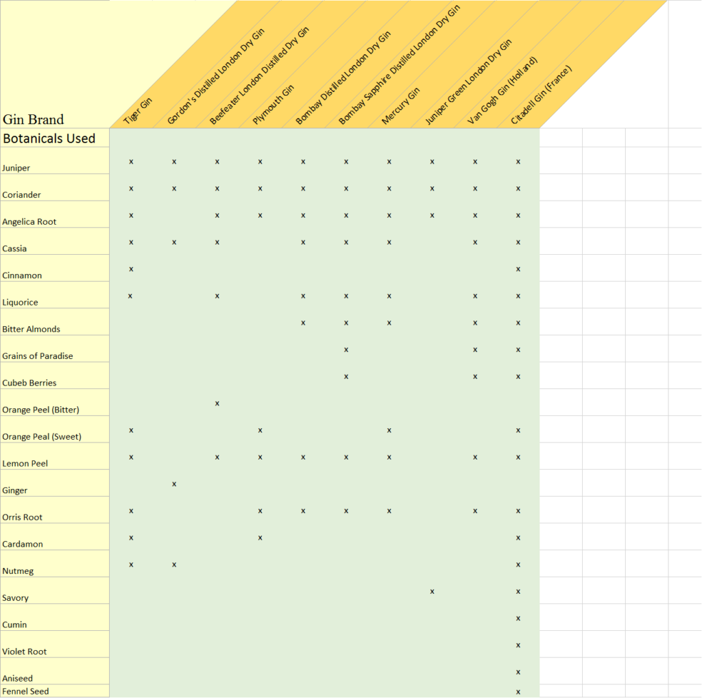

# Juniper mead / Gin recipes

## Juniper mead 
### Ratio #1: 1 oz / gallon

### Ratio #2: 4 berries / 750cl

### Infusion
    - Infusion 4oz juniper fronds with berries/Gallon -> 5 lbs wildflower honey
    - 3 gallons juniper infusion
    - 4 g fermaid k
    - 1.5 g DAP
    - Selland kviek culture

### Skyrim Juniper Mead
    - 3 lbs wildflower honey
    - 1 gallon spring water
    - 4 tablespoons crushed dried juniper berries
    - 2 tablespoons dried hibiscus flowers
    - 4 teaspoons dried yarrow
    - .095 starting gravity (12.5% potential ABV)

### Juniper, Rosemary, and Bay eaf
    - For 5gls
    - 8lbs honey
    - 1/2 cup fresh juniper berries
    - 2 bay leaves
    - 1oz Rosemary leaves
    - 1 pot Really strong pu--erh tea (very earthy flavor, high tannin)
    - Belgian Ale Wyeast (having faith in opinions posted here recently)

### Step feeding
    - 2 Tblsp at pitch, 
    - 1-2 Tblsp more at first rack and then 
    - 1-2 Tblsp more crushed maybe a week before bottling.

### Black Lagoon Hydromel
    - 12 dried juniper berries
    - 10 fresh bay leaves (cracked)
    - 3 (small) sprigs of fresh rosemary
    - 1.25-1.5 pounds honey
    - Water to 1 gallon.
    - Pitched ½ tsp Nottingham brewers yeast.
- I made a tisane with herbs by boiling for about 10 minutes then letting it steep for about an hour and a quarter. At the beginning it was a nice, pale green, after steeping it was a beautiful cranberry red (strain herbs out here), and when I added the honey it turned grey.

### Orange peel
    - 3.3 lbs honey
    - 1.5 oz. dried hibiscus petals
    - 1 oz. juniper berries
    - water to 1 gallon
    - Bread yeast (boiled to make yeast nutrient)
    - Lalvin EC-1118 (Wine yeast, for fermenting)
- Bring 3/4 gallons of water to a boil. Crack the juniper berries, then add them to the water. Add the hibiscus petals. Let steep for 30 minutes. Ladle off a bit into a small glass, and add some honey. Use that to rehydrate the EC-1118.
- Ladle off another portion into a small pot. Rehydrate the bread yeast, then bring to a strong boil. Add the honey to the jar. Grab an extra pitcher, and strain the juniper-hibiscus mix into it. Add the mix to the jar.
- By now everything should be cool. Add the boiled bread yeast to the jar. Add the hopefully now foamy EC-1118 to the jar. Measure the gravity, and adjust with honey or

---- 

## Gin recipes
### Commercial products

### DIY GIN RECIPE #1
    - 375 ml of good-quality vodka (about 12.5 oz or 1.5 cups)*
    - 2 tbsp juniper berries*
    - 1 cardamom seed
    - 1 peppercorn
    - ½ tsp coriander seed
    - ¼ of a cinnamon stick
    - 1 small, dried lemon peel*
    - 1 small, dried orange peel*

### HOMEMADE GIN RECIPE #2
    - 1 tbsp juniper berries
    - ½ tbsp of loose chamomile
    - 1 tbsp of rosehips
    - ½ Persian cucumber, cut into slices*
    - 1 tsp of lavender
    - 1 small, dried orange peel